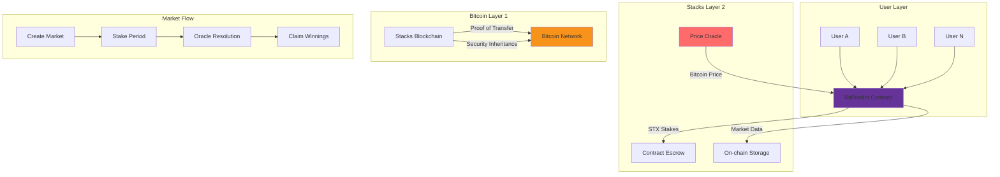

# BitPredict Protocol

## Decentralized Bitcoin Price Prediction Markets on Stacks

[](https://stacks.co)
[](https://bitcoin.org)

## Overview

BitPredict is a trustless prediction market protocol that enables users to stake STX tokens on Bitcoin price movements. Built on Stacks Layer 2, it combines Bitcoin's security guarantees with efficient smart contract execution, creating a transparent and decentralized platform for price discovery.

### Key Features

- 🔮 **Binary Price Predictions** - Stake on Bitcoin price "up" or "down" movements
- 💰 **Proportional Rewards** - Winners share the total pool proportionally to their stakes
- 🏛️ **Oracle-Based Resolution** - Trusted price feeds ensure accurate market settlement
- ⚡ **Layer 2 Efficiency** - Fast, low-cost transactions on Stacks blockchain
- 🛡️ **Bitcoin Security** - Inherits Bitcoin's security through Stacks' Proof of Transfer
- 📊 **Transparent Economics** - Configurable fees and minimum stake requirements

## Architecture



### System Components

1. **Smart Contract Core**: Manages market creation, stake handling, and reward distribution
2. **Oracle System**: Provides trusted Bitcoin price feeds for market resolution
3. **Escrow Mechanism**: Securely holds staked STX until market resolution
4. **Reward Engine**: Calculates proportional payouts for winning predictions

## Quick Start

### Prerequisites

- [Stacks CLI](https://docs.stacks.co/understand-stacks/command-line-interface) installed
- STX tokens for staking
- Compatible Stacks wallet (Hiro Wallet, Xverse, etc.)

### Deployment

```bash
# Deploy to Stacks testnet
stacks deploy --testnet bitpredict.clar

# Deploy to Stacks mainnet
stacks deploy --mainnet bitpredict.clar
```

### Basic Usage

#### 1. Create a Market (Owner Only)

```clarity
;; Create a market with Bitcoin at $45,000, active for 1000 blocks
(contract-call? .bitpredict create-market u4500000000 u1000 u2000)
```

#### 2. Make a Prediction

```clarity
;; Stake 5 STX on Bitcoin price going "up"
(contract-call? .bitpredict make-prediction u0 "up" u5000000)
```

#### 3. Claim Winnings

```clarity
;; Claim winnings after market resolution
(contract-call? .bitpredict claim-winnings u0)
```

## API Reference

### Public Functions

#### Market Management

| Function | Description | Parameters | Returns |
|----------|-------------|------------|---------|
| `create-market` | Create new prediction market | `start-price`, `start-block`, `end-block` | Market ID |
| `resolve-market` | Resolve market with final price | `market-id`, `end-price` | Success status |

#### User Operations

| Function | Description | Parameters | Returns |
|----------|-------------|------------|---------|
| `make-prediction` | Stake STX on price direction | `market-id`, `prediction`, `stake` | Success status |
| `claim-winnings` | Claim proportional winnings | `market-id` | Payout amount |

#### Administrative Functions

| Function | Description | Access | Parameters |
|----------|-------------|---------|------------|
| `set-oracle-address` | Update oracle address | Owner only | `new-address` |
| `set-minimum-stake` | Update minimum stake | Owner only | `new-minimum` |
| `set-fee-percentage` | Update platform fee | Owner only | `new-fee` |
| `withdraw-fees` | Withdraw platform fees | Owner only | `amount` |

### Read-Only Functions

| Function | Description | Returns |
|----------|-------------|---------|
| `get-market` | Retrieve market information | Market data structure |
| `get-user-prediction` | Get user's prediction details | Prediction data |
| `get-contract-balance` | Get total contract STX balance | Balance in micro-STX |
| `get-platform-config` | Get platform configuration | Config parameters |

## Economic Model

### Stake Distribution

```
Total Pool = Up Stakes + Down Stakes
Winner's Share = (User Stake / Winning Side Total) × Total Pool
Platform Fee = Winner's Share × Fee Percentage
User Payout = Winner's Share - Platform Fee
```

### Example Scenario

**Market Setup:**

- Bitcoin starts at $45,000
- 10 STX staked on "up"
- 5 STX staked on "down"
- Bitcoin ends at $46,000 (up wins)

**Payout Calculation:**

- Total pool: 15 STX
- User staked 2 STX on "up"
- User's share: (2/10) × 15 = 3 STX
- Platform fee (2%): 0.06 STX
- User payout: 2.94 STX

## Security Considerations

### Oracle Trust Model

- Single oracle design for initial deployment
- Oracle key management is critical
- Consider multi-oracle setup for production

### Smart Contract Security

- No external dependencies beyond Stacks runtime
- Immutable contract logic after deployment
- Comprehensive error handling and validation

### Economic Attacks

- Minimum stake requirements prevent spam
- Proportional rewards discourage manipulation
- Time-locked markets prevent front-running

## Development

### Local Testing

```bash
# Install Clarinet for local development
npm install -g @hirosystems/clarinet-cli

# Initialize project
clarinet new bitpredict-project
cd bitpredict-project

# Add contract
clarinet contract new bitpredict

# Run tests
clarinet test
```

### Test Coverage

- Market creation and validation
- Prediction placement and stake handling
- Oracle resolution and edge cases
- Reward calculation and distribution
- Administrative function access control

## Deployment Guide

### Testnet Deployment

1. **Prepare Environment**

   ```bash
   export STACKS_NETWORK=testnet
   export PRIVATE_KEY=your_private_key
   ```

2. **Deploy Contract**

   ```bash
   stacks deploy bitpredict.clar --network testnet
   ```

3. **Configure Oracle**

   ```bash
   stacks call-contract set-oracle-address ST1ORACLE... --network testnet
   ```

### Mainnet Considerations

- **Security Audit**: Conduct thorough security review
- **Oracle Setup**: Establish reliable price feed infrastructure
- **Economic Parameters**: Set appropriate fees and minimum stakes
- **Monitoring**: Implement contract monitoring and alerting

## Roadmap

### Phase 1: Core Protocol ✅

- Basic prediction markets
- Oracle integration
- Reward distribution

### Phase 2: Enhanced Features 🚧

- Multi-oracle support
- Advanced market types
- Liquidity incentives

### Phase 3: Ecosystem Integration 📅

- DEX integration
- Cross-chain bridges
- Mobile application

## Contributing

We welcome contributions! Please see our [Contributing Guidelines](CONTRIBUTING.md) for details.

### Development Process

1. Fork the repository
2. Create feature branch
3. Write tests for new functionality
4. Ensure all tests pass
5. Submit pull request

## Acknowledgments

- **Stacks Foundation** for Layer 2 infrastructure
- **Bitcoin Community** for the foundational security layer
- **Clarity Language** for safe smart contract development
